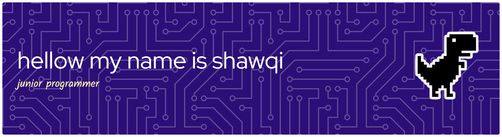

## Hellow welcome to my page 👋

<!--
**sawkey17/sawkey17** is a ✨ _special_ ✨ repository because its `README.md` (this file) appears on your GitHub profile.

Here are some ideas to get you started:

- 🔭 I’m currently working on ...
- 🌱 I’m currently learning ...
- 👯 I’m looking to collaborate on ...
- 🤔 I’m looking for help with ...
- 💬 Ask me about ...
- 📫 How to reach me: ...g
- 😄 Pronouns: ...
- ⚡ Fun fact: ...
-->


# Hi, I'm Shawqi Zhafirun Hayyan 



> Student • Web Developer • RPL Student • Still Learning, Still Building.

I'm a Software Engineering student who enjoys turning ideas into something that actually works.

Currently, I'm focused on **Web Development**, especially building websites with Laravel and PHP. 
I'm also exploring mobile development with **Dart & Flutter** and learning new things along the way.

I don't consider myself an expert. I'm just a student who likes to learn, build projects,
break things, fix them, and occasionally wonder why the code worked five minutes ago. 

---

## 👨‍💻 About Me

- 🎓 RPL Student at **SMK Sahabat Ilmu**
- 🌐 Interested in **Web Development**
- ⚙️ Currently learning **Laravel, PHP, JavaScript, Dart & Flutter**
- 🎨 Sometimes designing things with **Canva**
- 🎤 Interested in **Public Speaking & English**
- 🤖 Curious about **AI & new technologies**
- 📚 Currently building projects while learning
- ☕ Powered by curiosity and questionable amounts of debugging

---

## 🛠️ Tech Stack

### Languages
                                

### Frameworks & Tools
   


###

<picture data-importer="pacman">
  <source media="(prefers-color-scheme: dark)" srcset="https://raw.githubusercontent.com/maurodesouza/maurodesouza/pacman-output/pacman-contribution-graph-dark.svg?game=pacman">
  <source media="(prefers-color-scheme: light)" srcset="https://raw.githubusercontent.com/maurodesouza/maurodesouza/pacman-output/pacman-contribution-graph.svg?game=pacman">
  
</picture>

###


## 📖 Currently Learning

```text
Web Development
├── Laravel
├── PHP
├── JavaScript
└── Database

Mobile Development
├── Dart
└── Flutter

Other Interests
├── Artificial Intelligence
├── UI Design
├── Public Speaking
└── English


